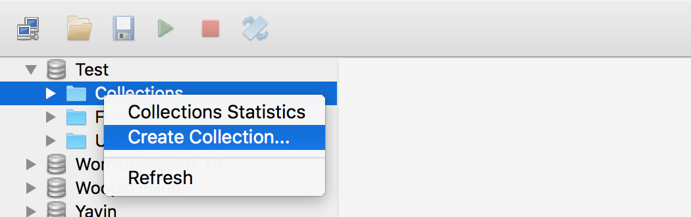
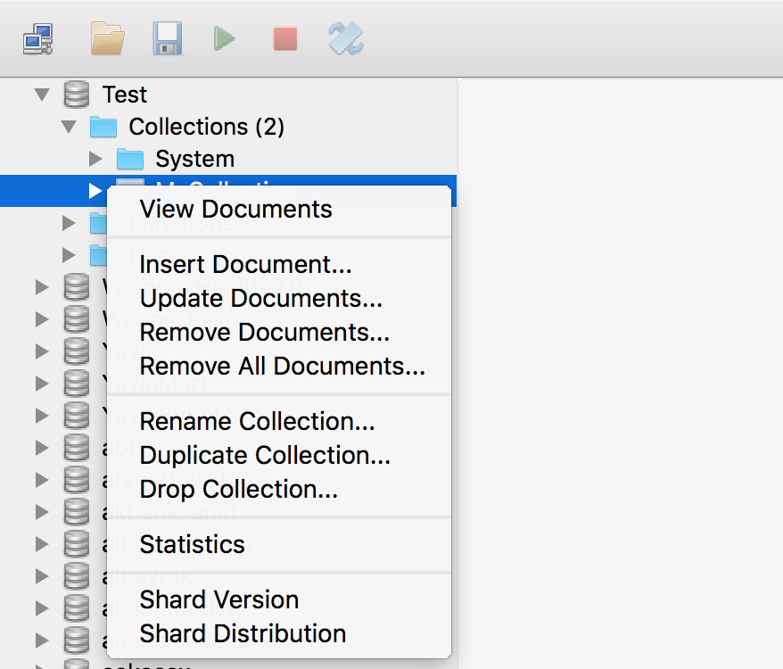
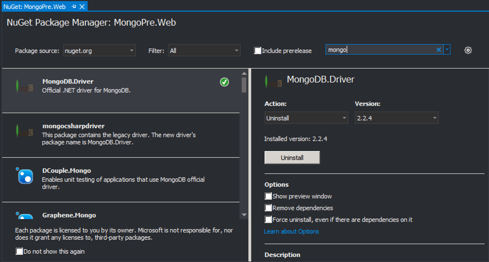

# MongoDbCSharpWorkshop
<h3>MongoDB indirme linki</h3>
https://www.mongodb.com/download-center?jmp=nav

<h1>Temel mongodb işlemleri</h1>

<h2>Terminal üzerinden </h2>
Sunucu üzerinden daha çok GUI'e sahip istemciler kullansak da terminal üzerinden de MongoDB'yi çalıştırabileceğiniz. 
Daha iyi anlamak adına temel terminal komutlarını sıralayalım.
Windows sunucuları üzerinde mongodb c:\programfiles\mongodb\server\3.x\bin dizininde kuruluyor. 
mongod.exe dosyasını çalıştırarak serveri başlattıktan sonra mongo.exe'yi çalıştırarak terminal üzerinden mongodb komut setlerini girebilirsiniz.

<ul>
<li>show dbs //tüm databaseleri gösterir</li>
<li>use dbname // dbname ile belirtilen database'i kullanacağınızı belirtir</li>
<li>show collections //ilgili db içindeki tüm koleksiyonları döndürür</li>
<li>db.CollectionName.find({}) //belirtilen koleksiyondaki dokümanları listeler</li>
<li>db.CollectionName.insert({Name:"Test"}) // koleksiyona kayıt ekledik</li>
</ul>

 
<h2>GUI için Robomongo</h2>
https://robomongo.org/download

Sunucuya sağ tıklayıp Create Database'yi seçerek DB oluşturabilirsiniz.


DB'yi oluşturduktan sonra seçimi genişletip Collections'a sağ tıklayıp Create Collection ile Koleksiyon oluşturabilirsiniz

Koleksiyon oluşturduktan sonra ilgili koleksiyona sağ tıklayıp Insert Document'i seçerek koleksiyona doküman ekleyebilirsiniz. 
Aynı menü üzerinden doküman silme, güncelleme ve istatisklerine de bakabilirsiniz.


<h1>Temel işlemler</h1>

<h2>1) Insert (Kayıt ekleme)</h2>
```

db.getCollection('Test').insert({
    Name:"Berk",
    CityId:32,
    CreatedAt:ISODate("1986-06-15")
})

//db.getSiblingDb("DBName").getCollection("colname") //... ile mevcut kullandığınız database'den farklı bir DB'de işlem yapabilirsiniz.
```
<h2>2) Find Metodu</h2>

<h3>a) Classical</h3>
```
// tüm kayıtları getirmek için
db.getCollection('Test').find({})

// eşlenen kayıtları getirmek için
db.getCollection('Test').find({Name:"Berk"})

// regex ile arama

db.getCollection('Test').find({Name:/e/}) // içinde e geçenler
db.getCollection('Test').find({Name:/e/i}) // içinde e ve E geçenler (i) incasesensitive
```
<h3>b) projection</h3>
```
// sadece belirli fieldları göstermek için
db.getCollection('Test').find({Name:/E/i},{Name:1,_id:0})
```
<h3>c) sort</h3>
```
// herhangi bir alana göre sıralama yapmak için
db.getCollection('Test').find({}).sort({CreatedAt:1})
```
<h3>d) limit ve skip</h3>
```
//belirli bir sayıda kayıt çekmek için
db.getCollection('Test').find({}).limit(2)

// belirli bir aralıktaki kayıtları getirmek için
db.getCollection('Test').find({}).skip(2).limit(2)
```
<h3>e) find sırasında and ve or kullanımı </h3>
```
db.getCollection('Test').find({
    
    $and:[{Name:/e/i,CityId:3}]

    }).sort({created_at:-1})

```
<h2>3) Update</h2>

<h3>a) Standart update</h3>
```
// bulunan ilk kayıtı değiştir
db.getCollection('Test').update({},{$set:{"CityId":0}})
```
<h3>b) Çoklu update</h3>
```
// bütün kayıtları değiştir
db.getCollection('Test').update({},{$set:{"CityId":0}},{multi:true})
```
<h3>c) object ekleme</h3>
```
//belirli bir alana obje ekle

db.getCollection('Test').update({Name:"Berk"},{$set:{"Gender":"e"}},{multi:true})
```
<h2>4) Delete</h2>
```
// belirli bir dokümanı sil
db.getCollection('Test').remove({Name:"Berk"})

// tüm dokümanları sil
db.getCollection('Test').remove({})
```
<h2>5) Aggregate</h2>
```
//isim alanında aynı olanları grupla ve say
db.getCollection('Test').runCommand('aggregate',
        {pipeline: [
                  
                    {$group: {_id: "$Name", counter: {$sum: 1}}},
                    {$sort: {counter: -1}},
                    {$limit: 10}
                    ],
        allowDiskUse: true})
        
 // match ile koşul ekle
 db.getCollection('albarakacomtr_FollowerTweet').runCommand('aggregate',
        {pipeline: [
                   {$match:{"Name":/e/}},
                    {$group: {_id: "$Name", counter: {$sum: 1}}},
                    {$sort: {counter: -1}},
                    {$limit: 10}
                    ],
        allowDiskUse: true})
```
<h2>6) Create Index</h2>
```
// azalan index oluştur

db.getCollection('FollowerTweet').createIndex({created_at:-1})
```
<h2>7) Map Reduce</h2>
```
var map=function()
{
    var textArr=this.text.split(' ');
    for (var i in textArr)
    {
        if (textArr[i].indexOf("@")!=-1 && textArr[i]!="@" && textArr[i].indexOf("(")==-1)
        {
            emit(textArr[i].replace("\"","").toLowerCase(),1);
        }
    }
    
   
};
var reduce=function(key,value)
{
    return Array.sum(value);
}


db.getCollection('Test').mapReduce(map,reduce,
{
    query:{$and:[{text:{$not:/RT @/}},{text:/@/},{text:{$not:/aracılığıyla/}}]},
    out:accounts[i]+"_Mentions"
});
```


<h1>C# driver</h1>

//nugetten en son offical driver'i kuruyoruz


<h2>1) Initilaziton</h2>
```
MongoClient mc=new MongoClient(); //localde kurulu olan mongodb ye default port üzerinden bağlantı yapmak için
MongoClient mc=new MongoClient("mongodb://1.1.1.1); //uzak sunucuda kurulu olan mongodb ye default port üzerinden bağlantı yapmak için
```

<h2>2) Insert BsonDocument</h2>
```
        MongoClient mc = new MongoClient();
        var db = mc.GetDatabase("Test");
        var col = db.GetCollection<BsonDocument>("Brand");
        var brand = new BsonDocument { { "Id", 2 }, { "Name", "test" },{"CityId",0 };
        col.InsertOne(brand);
```

<h2>3) Insert Poco</h2>
```
 public class Brand
    {
        public int Id { get; set; }
        public string Name { get; set; }
        public int CityId { get; set; }
    }
    MongoClient mc = new MongoClient();
    var db = mc.GetDatabase("Test");
    var col = db.GetCollection<Brand>("Brand");
    var brand = new Brand { Id = 67, Name = "test",CityId=3 };
    col.InsertOne(brand);
```

<h2>4) Find</h2>
```
            MongoClient mc = new MongoClient();
            var db = mc.GetDatabase("Test");
            var col = db.GetCollection<BsonDocument>("Brand");
            var brandBson = col.FindAsync(new BsonDocument{}).Result.FirstOrDefault();
```

<h2>5) Find Complex Query Building</h2>
```
            MongoClient mc = new MongoClient();
            var db = mc.GetDatabase("Test");
            var col = db.GetCollection<BsonDocument>("Brand");
            var filter = Builders<BsonDocument>.Filter.Eq("Id", 1);
            var f= Builders<BsonDocument>.Filter.Empty;
            if (true)
            {
            f = f & Builders<BsonDocument>.Filter.Eq("Name", "a");
            }
            var brandBson = col.FindAsync(f).Result.FirstOrDefault();
```

<h3>a) Projection</h3>
```
            MongoClient mc = new MongoClient();
            var db = mc.GetDatabase("Test");
            var col = db.GetCollection<Brand>("Brand");
            var filter = Builders<Brand>.Filter.Eq("Id", 1);
            var projection = Builders<Brand>.Projection.Include("Name");
            var brand = col.Find(filter).Project(projection)
```
<h3>b) Limit & Skip</h3>
```
            MongoClient mc = new MongoClient();
            var db = mc.GetDatabase("Test");
            var col = db.GetCollection<Brand>("Brand");
            var filter = Builders<Brand>.Filter.Eq("Id", 1);
            var projection = Builders<Brand>.Projection.Include("Name");
            var sort = Builders<Brand>.Sort.Descending("Name");
            var brand = col.Find(filter).Project(projection).Sort(sort).Skip(2).Limit(2);
```
<h3>c) Sort</h3>
```
            MongoClient mc = new MongoClient();
            var db = mc.GetDatabase("Test");
            var col = db.GetCollection<Brand>("Brand");
            var filter = Builders<Brand>.Filter.Eq("Id", 1);
            var projection = Builders<Brand>.Projection.Include("Name");
            var sort = Builders<Brand>.Sort.Descending("Name");
            var brand = col.Find(filter).Project(projection).Sort(sort);
```
<h2>6) Update</h2>
```
            MongoClient mc = new MongoClient();
            var db3 = mc.GetDatabase("Test");

            var col = db3.GetCollection<Brand>("Brand");
            var filt = Builders<Brand>.Filter.Eq("Id", 1);
            var upd = Builders<Brand>.Update.Set("Name", "Test1");
            col.UpdateManyAsync(filt, upd).Wait();
 ```
<h2>7) Delete</h2>
```
            MongoClient mc = new MongoClient();
            var db = mc.GetDatabase("Test");
           
            var col = db.GetCollection<Brand>("Brand");

            var filt = Builders<Brand>.Filter.Eq("Id", 1);

            col.DeleteOne(filt);
```
<h2>8) Aggregate</h2>
```
     var agbrands = new MongoClient().GetDatabase("Banks").GetCollection<BsonDocument>("albarakacomtr_FollowerTweet")
                .Aggregate().Group(
                new BsonDocument { { "_id", "$url.expanded_url" },
                    { "count", new BsonDocument("$sum", 1) } }).ToListAsync().Result;
           
```


