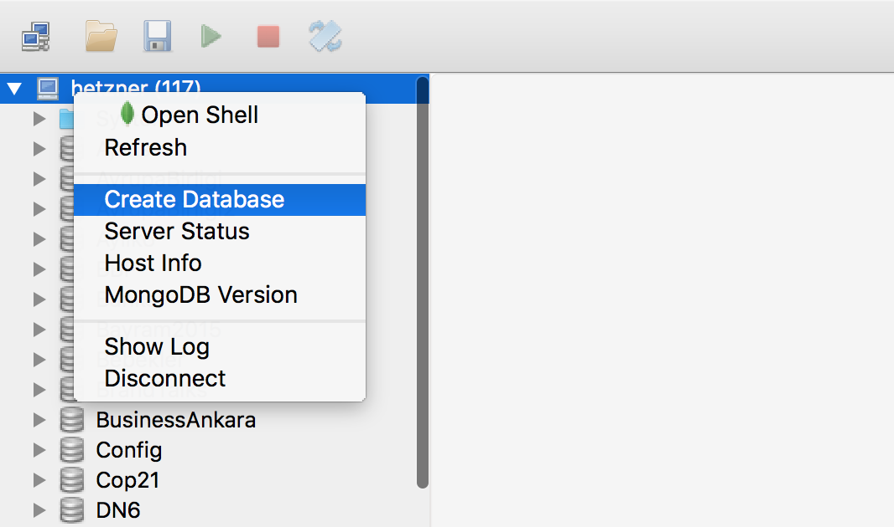

# MongoDbCSharpWorkshop
<h3>MongoDB indirme linki</h3>

<h1>Temel mongodb işlemleri</h1>

<h2>Terminal üzerinden </h2>
Sunucu üzerinden daha çok GUI'e sahip istemciler kullansak da terminal üzerinden de MongoDB'yi çalıştırabileceğiniz göstermek adına temel terminal komutlarını sıralayalım.
windows sunucuları üzerinde mongodb c:\programfiles\mongodb\server\3.x\bin dizininde kuruluyor mongod.exe dosyasını çalıştırarak serveri başlattıktan sonra mongo.exe'yi çalıştırarak terminal üzerinden mongodb komut setlerini girebilirsiniz.

<ul>
<li>show dbs //tüm databaseleri gösterir</li>
<li>use dbname // dbname ile belirtilen database'i kullanacağınızı belirtir</li>
<li>show collections //ilgili db içindeki tüm koleksiyonları döndürür</li>
<li>db.CollectionName.find({}) //belirtilen koleksiyondaki dokümanları listeler</li>
<li>db.CollectionName.insert({Name:"Test"}) // koleksiyona kayıt ekledik</li>
</ul>

 
<h2>GUI için Robomongo</h2>
https://robomongo.org/download

Sunucuya sağ tıklayıp Create Database'yi seçerek DB oluşturabilirsiniz.

DB'yi oluşturduktan sonra seçimi genişletip Collections'a sağ tıklayıp Create Collection ile Koleksiyon oluşturabilirsiniz

Koleksiyon oluşturduktan sonra ilgili koleksiyona sağ tıklayıp Insert Document'i seçerek koleksiyona doküman ekleyebilirsiniz. 
Aynı menü üzerinden doküman silme, güncelleme ve istatisklerine de bakabilirsiniz.

<h1>Temel işlemler</h1>

<h2>1) Insert (Kayıt ekleme)</h2>

<h2>2) Find</h2>

<h3>a) Classical</h3>

<h3>b) projection</h3>

<h3>c) sort</h3>

<h3>d) limit</h3>

<h3>e) and ve or</h3>

<h2>3) Update</h2>

<h3>a) Standart update</h3>

<h3>b) Çoklu update</h3>

<h3>c) object ekleme</h3>

<h2>4) Delete</h2>

<h2>5) Aggregate</h2>

<h2>6) Create Index</h2>

<h2>7) Map Reduce</h2>

<h1>C# driver</h1>

<h2>1) Initilaziton</h2>

<h2>2) Insert BsonDocument</h2>

<h2>3) Insert Poco</h2>

<h2>4) Find</h2>

<h2>5) Find Complex Query Building</h2>

<h3>a) Projection</h3>

<h3>b) Limit</h3>

<h3>c) Sort</h3>

<h2>6) Update</h2>

<h2>7) Delete</h2>

<h2>8) Aggregate</h2>

<h2>9) Connection string</h2>

